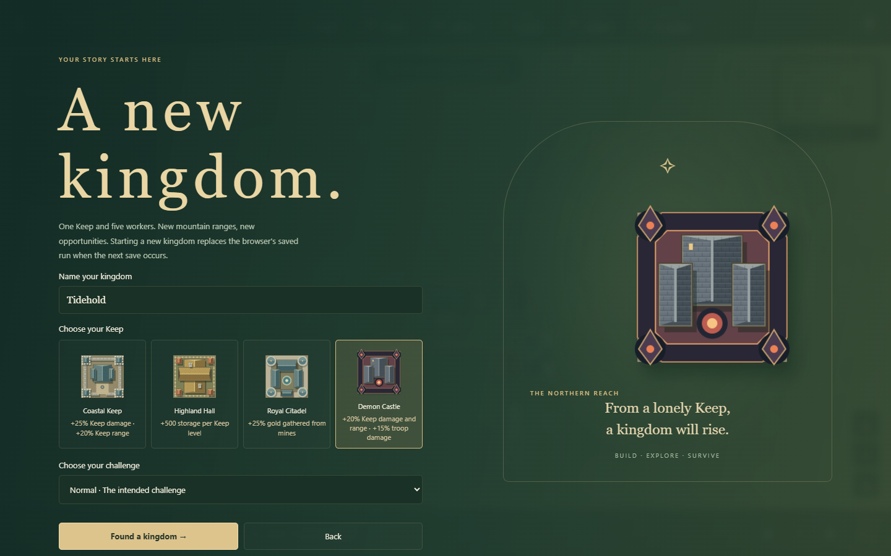
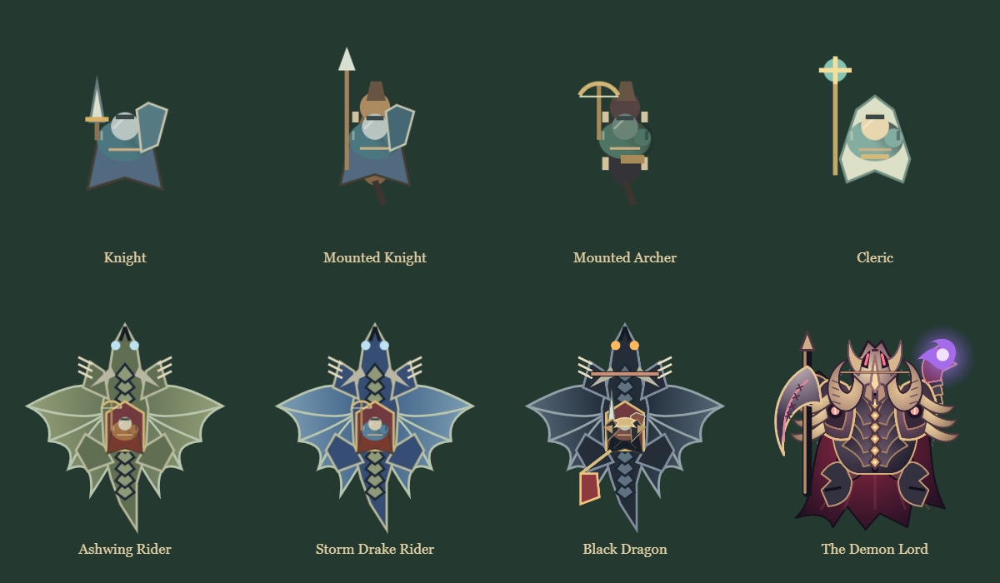
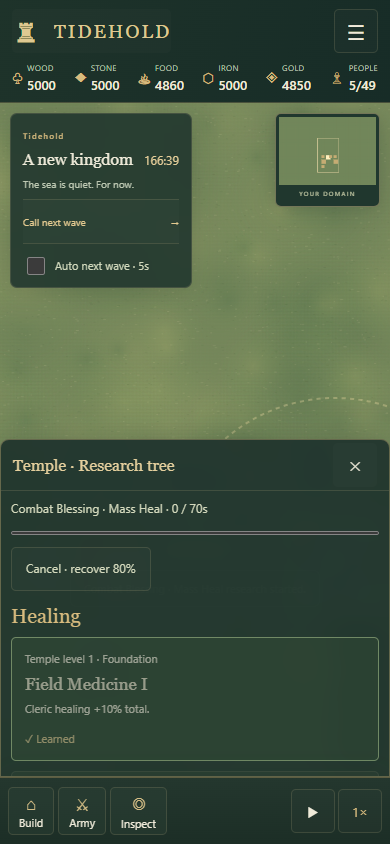

# Walls, faith and royal legacies

## Keep choices

| Keep | Perk |
| --- | --- |
| Coastal Keep | +25% Keep arrow damage and +20% Keep range. |
| Highland Hall | +500 storage per Keep level, in addition to base and Warehouse storage. |
| Royal Citadel | +25% gold collected by gold miners. |
| Demon Castle | +20% Keep damage/range and +15% friendly unit damage. Unlock by winning Nightmare. |

The Demon Castle is locked on the New Kingdom screen until Nightmare victory. The reward is stored separately from the active kingdom, survives starting another game, and recognizes older Nightmare victory saves. Each choice has distinct overhead artwork and updates the large preview.

## Walls and movement

Walls connect to Archer Towers and Ballista Towers. Foot archers and crossbowmen can traverse a connected wall/gate/tower network without climbing down. Wall and gate sections hold two defenders; towers hold four. Orders reserve the destination. A broken connection stops the order; destruction of the occupied section still causes a fall. Wall occupants take **55% less damage**, in addition to their armor and protection from grounded melee attacks.

Ground routing minimizes travel time, accounting for the 30% speed increase on completed roads. Units enter a nearby road when it saves time and avoid long road detours. Peaks and solid buildings retain their movement restrictions.

Group commands assign a reachable formation destination to each selected unit. A blocked destination no longer prevents subsequent selected units receiving orders. Units that cannot reach any nearby destination report that limitation while reachable units continue. Mixed groups can send foot archers onto walls while their ground companions move beside them.

Canceling unfinished construction restores the exact remaining quantities of its covered trees and deposits, including after saving/loading. Once construction completes, those deposits are permanently removed; demolishing a finished building does not recreate them. Older blueprints without a saved deposit snapshot cannot reconstruct unknown resources.

## Troops and trainers

| Unit | Requirements | Trains at |
| --- | --- | --- |
| Knight | Keep level 3, Barracks | Barracks |
| Mounted Knight | Keep level 3, completed Stable and Barracks | Stable |
| Mounted Archer | Keep level 3, completed Stable and Archery Range | Stable |
| Cleric | Keep level 2, completed Temple, available Cleric cap | Temple |

Existing saved mounted Knights and their queued orders migrate to Mounted Knights. New infantry Knights keep their identity across subsequent saves. Cavalry training waits if a prerequisite building is destroyed. Queued orders reserve population and their original refund costs.

## Blacksmith research

Research requires a completed Blacksmith at the displayed tier: levels 1, 2 and 3 unlock their matching research tiers. Existing prerequisite research still applies. A project waits if its required building level becomes unavailable.

- **Steel axes** (Blacksmith level 2, Managed forests): woodcutters chop 30% faster.
- **Master masonry** (Blacksmith level 3, Pack frames): completed buildings below level 2 rise to level 2; future buildings finish at level 2. Higher levels remain intact. Queued construction gains the benefit when completed.

## Temple and Clerics

Only one Temple may be placed, counting unfinished sites. Its level permits **two Clerics per level** (2/4/6/8/10), including queued Clerics. Existing Clerics are retained if the Temple is destroyed; further training waits for sufficient capacity.

A Cleric heals up to three wounded allies each second, prioritizing the most injured by health percentage, within **5.25 tiles**. Base healing is 8 HP per target per second. The Temple itself heals nearby friendly units for 3 HP per second within six tiles. Selected Clerics and Temples show their healing radius.

Temple research uses Temple levels independently of the Blacksmith:

| Research | Temple level | Effect |
| --- | --- | --- |
| Field Medicine I / II / III | 1 / 2 / 3 | +10% / +20% / +30% total Cleric healing. |
| Combat Blessing: Mass Heal | 2, Field Medicine I | Automatically heals all wounded allies in range for 20 base HP every 12 seconds, improved by Field Medicine. |
| Sacred Resolve I / II / III | 1 / 2 / 3 | Nearby allies gain +5% / +10% / +15% damage and +1 / +2 / +3 armor. Multiple Cleric auras do not stack. |

## Dragon riders and boss artwork

Ashwing Riders begin appearing from wave 16, with stronger Storm Drake Riders from wave 32. They approach airborne and can only be hit by ranged attacks while in flight. The Black Dragon's first phase visibly carries the Conqueror in a saddle with his banner. Its body, clawed limbs and articulated wings have been redrawn. The Demon Lord has been rebuilt as the Cinder Sovereign: a curved bone death mask, curling ram horns, ribbed blackened armor with gold inlay, a shredded crimson mantle, a hooked executioner’s glaive, and a violet soul flame in his claw. Its sculpted overhead body uses its own curved artwork throughout.

## Validation

105 simulation tests pass, including road travel-time choices, group formation orders, connected wall movement and cover, resource restoration, all Keep perks and legacy unlocks, troop migration and prerequisites, research tier gates, Temple caps, healing and non-stacking buffs. Existing two sets of 100 seeded world-generation checks remain green.

The expansion browser suite covers 1440×900 desktop, 768×1024 tablet, 390×844 and 320×568 phones, and 844×390 landscape, plus orientation changes. It exercises real research/recruitment controls, full group movement commands, connected wall travel, and winning Nightmare to unlock and start a Demon Castle kingdom. Nightmare, construction, usability and offline release suites also pass. Eight 700-second opening probes retain their Keeps; this remains bounded opening evidence rather than a full organic campaign claim.

Easy now ends after clearing wave 40, with optional endless continuation. Normal and Hard remain 50 waves; Nightmare remains 60. Active enemies must be defeated before victory is awarded, including when continuing an older Easy save.
