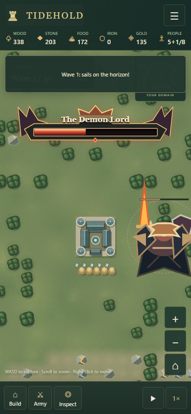
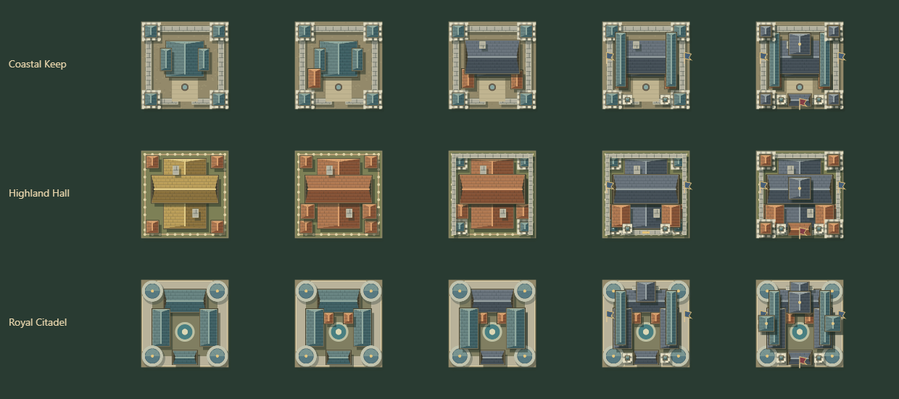
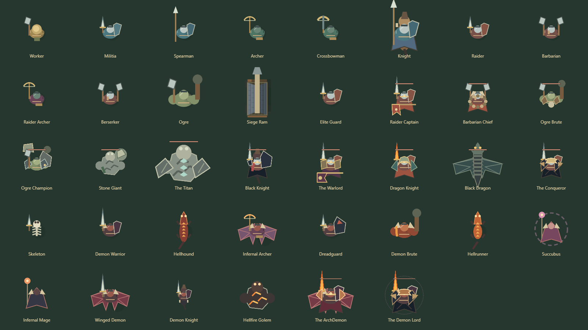

# The broken seal

Nightmare kingdoms begin on a larger island. Defeating the Conqueror at wave 50 turns the world crimson and opens ten further demon invasions. New armies emerge from visible coastal portals. Archers, crossbowmen, Keep arrows and defense towers can damage airborne enemies; melee defenders can attack only after a flyer lands.

| Enemy | Role and response |
| --- | --- |
| Skeleton | Fast, fragile swarm. Keep a supporting army behind your defenses. |
| Demon Warrior | Standard demonic infantry. |
| Hellhound | Very fast archer hunter. Screen your ranged troops. |
| Infernal Archer | Flies and fires burning arrows. Stone buildings resist ignition. |
| Dreadguard | Tank with a taunt that draws attacks away from allies. |
| Demon Brute | Huge wall hunter, 35% defense. Melee attackers catch fire. |
| Hellrunner | Leaps over walls and rushes the Keep. Keep reserves inside. |
| Succubus | Strengthens nearby demons. |
| Infernal Mage | Area attacks and summoned reinforcements. |
| Winged Demon | Flies into rear production areas. Distribute ranged cover. |
| Demon Knight | Fast armored cavalry. |
| Hellfire Golem | 40% defense, very high HP, area attacks, instant destruction of its wall target. |

Boss abilities trigger and resolve automatically. Intrusive attack-warning popups and the phase/defense subline have been removed. The boss HUD contains only the name and health, with progressively more elaborate heraldry. Ground attack effects remain.

## Wave 55: ArchDemon

The giant winged commander carries a flaming blade, has 50% defense and can open additional portals. His diving strike marks the ground before impact, then leaves him landed for five seconds and vulnerable to melee. His portal ward lasts up to ten seconds; killing the marked guardians breaks its extra protection. His hellfire cross leaves gaps between the warned circles.

## Wave 60: Demon Lord

A massive portal admits the armored Demon Lord. His 60% defense and aura support an army of summoned demons. He throws warriors at rear buildings, marks hellfire eruptions, and creates a ring with a safe inner area. At half HP he heals for five seconds under heavy damage reduction, then increases his movement speed and summoning frequency and rushes the Keep. Keep a reserve and leave exits through your fortifications.

Earlier Nightmare milestones also gain extra attacks: reserves, axe sweeps, boulders, rolling stones, Titan aftershocks, the Black Knight’s oathguard, arrow storms, cinder rings, wing tempests and the Conqueror’s royal reckoning. Ground markings and enemy inspection explain the immediate threat.

The screenshots use deterministic encounter fixtures. Actual kingdoms still begin with only a Keep and five workers.

## Visible progression

Completed upgrades add wings, workshops, machinery, irrigation, galleries, towers and stronger weapon platforms. The same cached artwork appears in building cards and the world.

