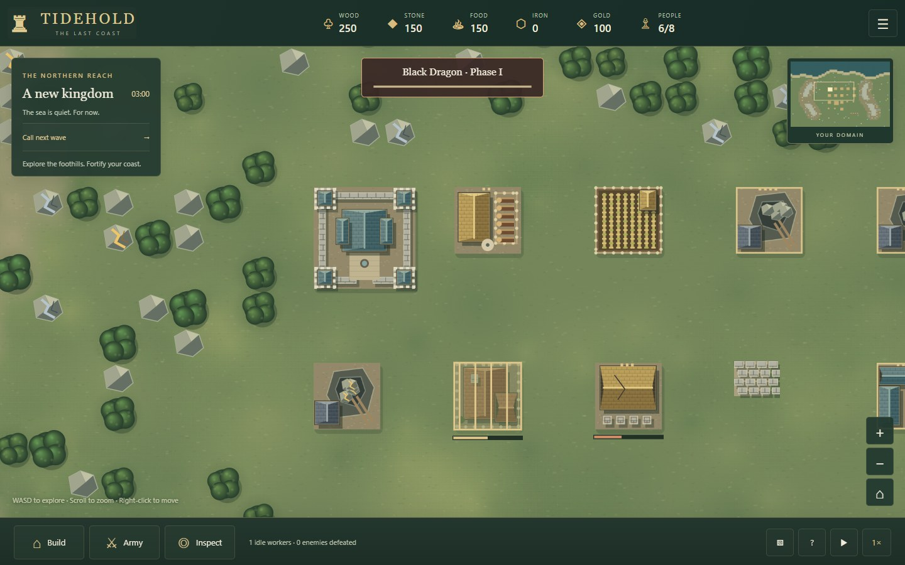
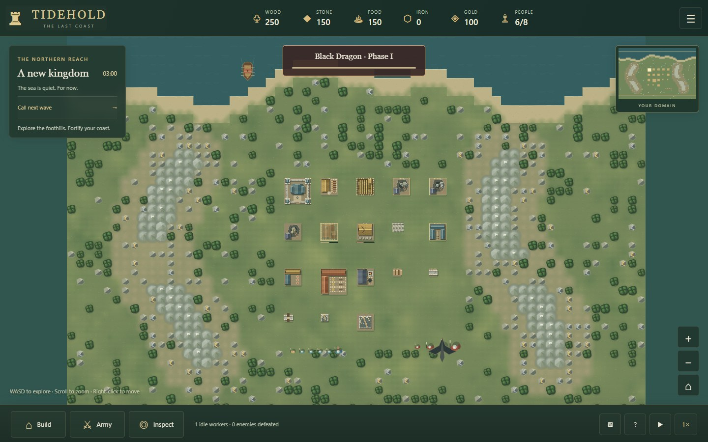
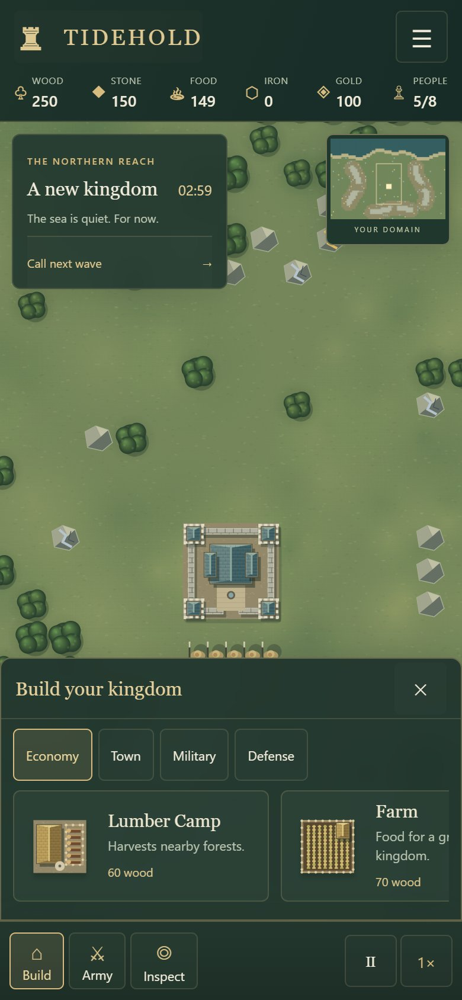

# Overhead world and mountain update

The redesign uses local Canvas artwork and cached building textures. Roofs, courtyards, tree canopies, workers, defenses, and ships share an overhead perspective. The same roofs appear in the construction cards. All artwork and styles are bundled into the offline HTML release.

## Validation

- **22 simulation tests**, including generation checks over **100 fixed seeds**.
- Every tested seed preserves the starting area, connected landing routes, accessible deposits, and greater mineral density in the foothills.
- Mountain collision, enemy breach behavior, flying movement, blocked mines, ore depletion, partial-load delivery, recruitment exits, and legacy map saves are covered.
- Chromium browser checks cover 1440×900 desktop, 1024×768 tablet, 390×844 portrait, 320×568 small portrait, and 844×390 landscape with mouse or emulated touch.
- Nested menus preserve both running and paused states. Tests verify saving before the title screen, storage-failure behavior, deposit inspection, locked-action explanations, build cancellation, and orientation changes.
- The release check exercises group commands, keyboard pause, save preservation, wave state, and opening the single HTML file while offline.

These are browser emulation checks; physical iOS/Android certification and a full human-played campaign balance pass remain outside this update.

## Screenshots

### Roof and material details



### Mountain ranges, passes, and mineral foothills



The two images above use a fixed-seed visual test fixture with all structures, construction and damage states, units, a ship, and bosses. That fixture is confined to the test script. A real new kingdom still starts with one Keep and five workers.

### Phone interface



## Repeat the checks

```sh
npm test
npm run build
npm start
```

With the server running, set `PLAYWRIGHT_PATH` and `CHROME_PATH` if needed, then run:

```sh
node tools/browser-test.mjs
node tools/design-test.mjs
node tools/release-test.mjs
```

Screenshots and browser results are written to the ignored `artifacts/` directory. Existing saves are loaded from their stored tiles; terrain generation is never reapplied to an old kingdom.
