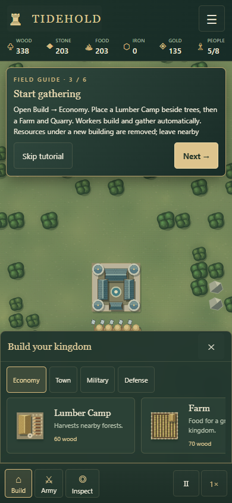
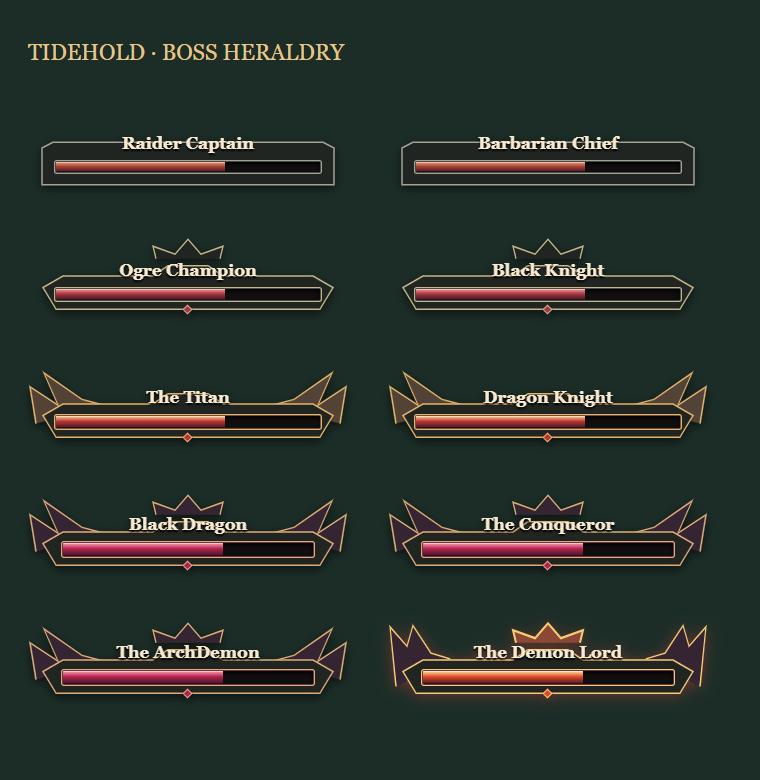

# A gentler beginning and clearer combat

## Kingdom controls

- Construction can replace wood, stone, iron and gold deposits. Only deposits inside the footprint are covered; cancel unfinished construction to restore their remaining resources. Completion permanently removes them, with no free resource payout. Explicit worker clearing still recovers resources. Mines still need reachable deposits nearby.
- Units occupying a planned site move to free ground in their existing connected region before the footprint becomes solid. Invalid or unaffordable plans leave units and resources untouched. Mountains, water and existing buildings remain invalid sites.
- The Keep automatically fires arrows within 260 world units, dealing 20 base damage every 1.2 seconds. Levels and defensive upgrades improve it. Like other ranged defenses, it can target flying enemies; melee still cannot target airborne enemies.
- Cream directional arrows on the minimap show incoming fleets, including ships outside the map boundary. Markers disappear after landing.
- The large New Kingdom preview shows the selected Keep at its actual starting level.

## Difficulty and preparation

| Mode | Starting peace | Between waves | Starting supplies | Wave count factor | Enemy HP / damage factors |
| --- | --- | --- | --- | --- | --- |
| Easy | 6 minutes | 3 minutes | 1.60× | 0.55× | 0.60× / 0.65× |
| Normal | 5 minutes | 2.5 minutes | 1.35× | 0.80× | 0.85× / 0.85× |
| Hard | 4 minutes | 110 seconds | 1.15× | 1.05× → 1.20× | 1.08× → 1.25× / 1.03× → 1.15× |
| Nightmare | 3.5 minutes | 100 seconds | 1.10× | 1.12× → 1.35× | 1.18× → 1.45× / 1.10× → 1.30× |

Factors apply to the shared definitions. Hard/Nightmare interpolate through wave 12 and then retain their established late-game tuning. Easy/Normal also reduce special-attack damage. Five-second Auto wave remains an explicit fast-forward option.

The opening countdown waits for a successful construction, recruitment, upgrade, resource-clearing, worker-assignment or unit-movement action. Panning, selecting, browsing menus and invalid orders do not use preparation time. Food does not drain before the first action. Manually calling a wave starts it immediately. Existing saves retain their current timers and are considered started unless they contain the new saved first-action flag.

First-time Easy/Normal players receive six in-game lessons covering controls, economy, workers, housing, recruitment, defense and fleet detection. They can keep playing while the guide is open, but the first invasion countdown waits. Next, Start playing and Skip tutorial remain accessible on short screens. Progress saves with the kingdom; completion or skipping is remembered in browser storage. Menus preserve simulation pause independently.

## Boss health

Names and health bars are the only visible header text. Early bosses use restrained iron frames; later bosses gain crowns, winged gold frames, obsidian horns and finally the Demon Lord's glowing crown. Health updates retain a delayed damage trail, with motion disabled by the reduced-motion preference. Screen readers receive current and maximum health. Nightmare's difficulty description is “for experienced players, the broken seal”.

Boss attacks execute automatically without attack-warning popups. Existing attack timing, ground effects, landing windows and Nightmare abilities remain active.

## Verification

105 simulation tests pass, including 100 fixed mountain seeds and 100 island seeds. Added coverage checks first-action and tutorial timers, save migration, difficulty progression, occupied resource placement, atomic failure, Keep arrows against ground/air targets, and automatic boss attacks without popups.

The usability browser suite checks desktop 1440×900, tablet 768×1024, phone 390×844, small phone 320×568 and landscape 844×390, plus orientation changes. It verifies Keep previews, tutorial navigation and clipping, pause restoration, initial countdown, fleet marker pixels and all five boss tiers. Nightmare, construction, polish and offline release suites also pass.

Eight 700-second strategy probes (seeds 42 and 707 in each mode) use real starting supplies, construction, gathering and recruitment. All retain full Keep HP; Easy/Normal lose no units. These probes cover openings rather than proving a full campaign or replacing player feedback. The single-file build launches with the browser offline and requires no downloaded assets.
